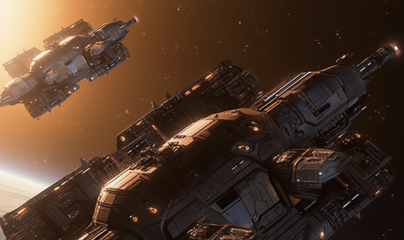
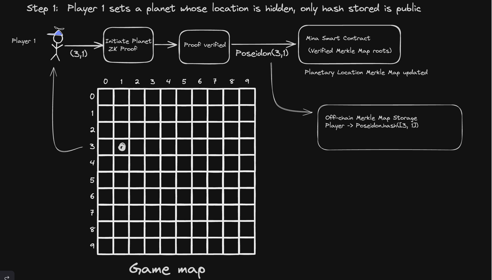
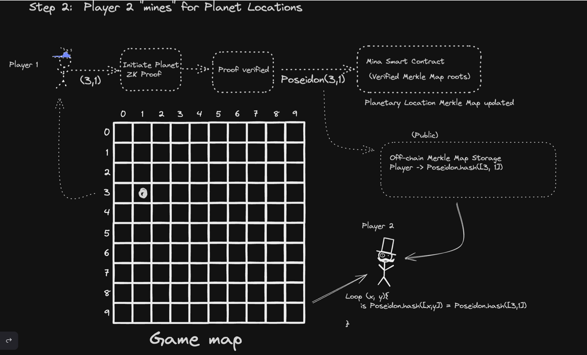
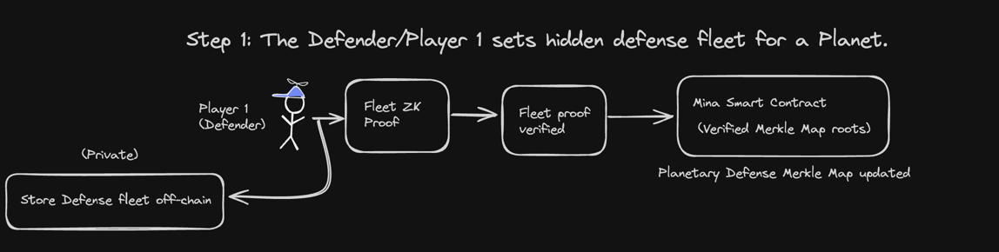
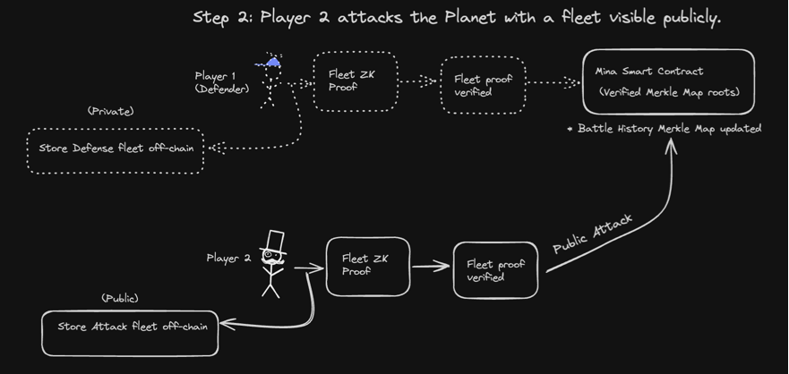
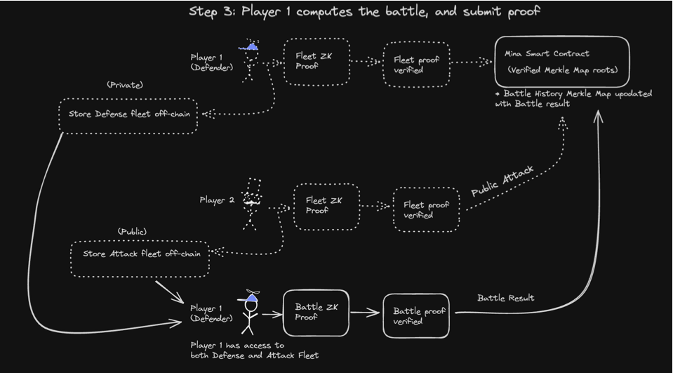
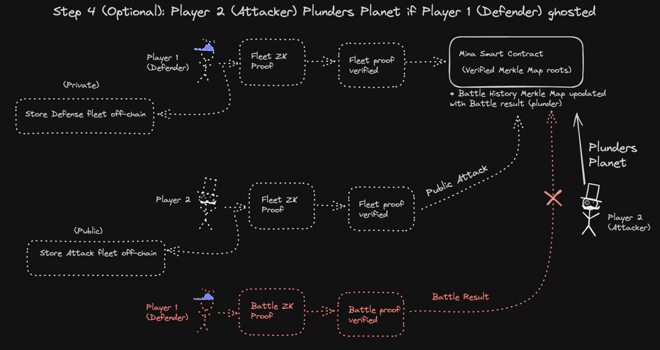

# Dark Armada: Masters of  the Void

## Background

"Dark Armada: Masters of the Void" is a massively multiplayer online (MMO) game that utilizes Zero Knowledge Proofs (ZKPs) to create a verifiable fog of war. Inspired by the "Dark Forest zkSNARK space warfare" game, which was implemented on EVM with Circom circuits, this version is developed in O1js—a TypeScript embedded DSL for ZK—and the contracts are deployed on Mina. Additionally, the game logic has been significantly revised to enhance strategic depth,a nd provide a completely different experience than that of "dark forest".

## Introduction to the game 

Imagine an expansive galaxy teeming with myriad planets, each fortified and primed for cosmic conflict. As a player, you are thrust into this universe by assuming command of one of these planets, becoming its ruler and guardian. Upon embarking on this interstellar journey, players take control of planets and covertly organize defensive fleets, concealed from adversaries through the use of zero-knowledge proofs (zk-SNARKs). 

Both the planet coordinates and their defensive strategies remain private. Only the hashes of these coordinates and defensive tactics are stored in public off-chain storage. The Mina smart contract on-chain maintains the root of Merkle Maps for planet location and planet defense, verifying the integrity of the off-chain storage.


## How are Planets initiated and discovered?

Planet coordinates are kept private, with only their Poseidon hash values stored in public off-chain storage. The on-chain Mina smart contract secures the integrity of these locations through the root of Merkle Maps. Players must "mine" to uncover the concealed coordinates of other planets, scanning the vast universe with limited range and employing Poseidon hash collision techniques to discover them.

Picture yourself navigating the immense universe, where you're limited to scanning (enumerating) the nearby space—using hash collision to seek out other planets.

Here is the 2 step process of Initiating a planet, and "mining" for the location of the planet: 

Step 1: Initiating Planets

A player picks a co-ordinate, e.g. (3,1), and generates proof that those co-ordinates are within the game universe. Once the proof is verified on Mina Blockchain, the merkle map root is updated, and the markle map is stored off-chain.



Step 2: Mining (Discovering Hidden Planets)

Other players, represented by Player 2 here, "mines" for the location of planets. Player 2 iterates over pairs of co-ordinate values (x, y), applying the Poseidon hash function to each pair, and comparing the resulting hash to the hash of a specific pairs, that has initiated planets. In our example [3,1] is one such pair.



## How Battles work? 

Once a player discovers another planet, they have the option to "attack" it. However, the defensive measures of the planet remain confidential, while the attacks are conducted openly. The outcome of the defense, whether successful or not, results in the leakage of some information, enabling future attackers to formulate educated guesses about the planet's defenses.

Here's the 4 step process of how battles work: 

Step 1: Initiating Defense Fleet

Player 1 (Planet owner), sets up a hidden defense fleet for a planet. The details of this fleet are kept private and stored off-chain. To validate the existence and the integrity of the fleet without revealing its specifics, a zero-knowledge proof (ZK Proof) is generated and then verified. Once the proof is verified, the merkle map roots to reflect the new state in Mina blockchain.



 Step 2: Public Attack

Player 2 initiates a public attack on a planet by deploying an attack fleet, the details of which are stored off-chain but visible to all. A zero-knowledge proof for this fleet is generated and verified. Upon successful verification, the Mina smart contract is updated to include the new proof in the verified Merkle Map roots.



Step 3: Battle Computations

 Since only the defender (Player 1) possesses complete knowledge of their defense fleet, they are responsible for calculating the outcome of the battle, taking into account both their private defense details and the publicly known attacking fleet. They must then submit both the proof and the result of the battle on-chain. This two-step resolution process, although less than ideal, affects the user experience. Unfortunately, it was the only method I could devise to ensure a fair and verifiable battle.



Step 4(Optional) : Plunder Planet

If the defender (Player 1) anticipates that an incoming attack will likely lead to a defeat, they may opt to "ghost" the attacker by failing to submit the required proof. To address this scenario, we've introduced a "collect forfeit" mechanism. This allows an attacker (Player 2) to essentially loot the planet if the defender does not provide proof of defense within a specified timeframe.



## Zero-knowledge Proof Application

Dark Armada uses ZKP to prove 3 operations regarding planet location and fleet engagements: 

1. Planet initiation - verify that the location is within the game universe.
2. Planet defense initialization - verify that the defense fleet follows game rules regarding fleet composition and maximum strtength.
3. Battle Computation - verify that the battle computation is correct based on the engagement rules.

### Planet Initiation 

### Planet Defense Initialization

### Fleet Movement

### Battle computation 


## Game Objects
The most important aspect of the dark forest universe is `Planet`

```typescript
export class Planet extends Struct({
  id: Field,
  population: Field,
  position: CircuitString,
  populationCap: Field,
  populationGrowth: Field,
  ore: Field,
  oreCap: Field,
  oreGrowth: Field,
}){ }
```

The Planet has two resources - population and ore (more can be added later), both of which grows gradually, and has a cap. 

The Planet's position that is kept secret. Players can only observe (detect) the limited universe around them as they move around (enumerate) through the coordinates. They can detect other planets with hash collisions 

```typescript
export class Position extends Struct({
  x: Field,
  y: Field,
  panetId: Field
}){ }

```

Players can also move their Fleet, and move population or Ore with it. It is represented by the Struct as follows

```typescript
export class Movement extends Struct({
  id: Field,
  initiator: PublicKey,
  fromPlanet: Field,
  toPlanet: Field,
  popArriving: Field,
  oreMoved: Field,
  departureTime: Field,
  arrivalTime: Field
}){ }
```

If the population landed via fleet exceeds current population of the planet, player can take over the planet. If the planet already belonged to a player, then the population gets added. 

## Spawning Solar systems/Planets
Creating a universe that balances realism with engaging gameplay presents a unique challenge. 
We use Poseidon hash functions to generate planet coordinates, adjusting their rarity by modifying the number of leading zeros in the hash values. This method creates a randomized yet controlled distribution of planets, essential for gameplay dynamics. The scripts for the numerical tests is in `helpers/birthing.ts` 

### Numerical Insights
**Initial Test**: On a 200 x 200 grid, the number of planets varied significantly with the change in leading zeros:

* With no leading zeros, 34,930 planets (87.325% of coordinates)
* With one zero, 7,151 planets (17.8775%)
* With two zeros, 243 planets (0.60825%)

Increasing zeros further drastically reduced the number of planets.

**Realistic Comparison**: In reality, only about 14 known stars exist within a 10 light-year radius of our Sun. This sparsity contrasts with the game's initial setting, where around 190 stars are placed within a 100 light-year radius, with a difficulty of three leading zeros.


## References 

* [Simple Game Explanation](https://trapdoortech.medium.com/dark-forest-one-interesting-game-with-zk-snark-technology-47528fa7691e)
* [ZK Global Game Overview](https://www.youtube.com/watch?v=nwUCccUS75k)
* [Original DF git repo](https://github.com/darkforest-eth)


## Mining Planets (Benchmarking)

The coordinates of planets are stored as private data and are not publicly disclosed.The only information available to the public is the Poseidon hash of these coordinates, leveraging the Poseidon.hash([x, y]) function, known for its efficiency in SNARK-friendly environments.

In a game arena, be it a square grid of dimensions N x N or a circle with radius R, the objective is to discover the private coordinates of all planets. This is achieved through identifying hash collisions - by generating and comparing the Poseidon hashes for every possible coordinate pair within the game's defined space.

Thhe experiment at `helpers/exp/mining.ts` aims to determine the time frame necessary to uncover the coordinates of all planets via hash collisions. The findings from this experiment will be pivotal in defining the size of the search space (game world), ensuring it offers an adequate level of challenge while maintaining cryptographic integrity.

We also compare Poseidon with with Keccak 

#### Poseidon hashing on M1 Mac
* time taken to hash 100 coordinates: 29 ms
* time taken to hash 1000 coordinates: 253 ms
* time taken to hash 10000 coordinates: 2475 ms

#### Keccak256 hashing on M1 Mac
* time taken to hash 100 coordinates: 124 ms
* time taken to hash 1000 coordinates: 1043 ms
* time taken to hash 10000 coordinates: 10320 ms

Hashing with `Hash.SHA3_256.hash(bytes), Hash.SHA3_512.hash(bytes) and Hash.SHA3_384.hash(bytes)`, yielded similar results to keccak256 

Therefore, it might be better to use the Keccak hash to save planet locations publicly to add extra layer of protection. Ironically, because Keccak is less efficient, it yields better protection.

According to [Shigoto-dev19](https://github.com/Shigoto-dev19)'s, recommenation we should probably just use Poseidon chain hash - that is to create a final hash, we can hash the function to itself N number of times to increase the time 

### Chain Poseidon (1000) on M1 Mac 
* time taken to hash 100 coordinates: 25062 ms

We can arbitrarily increase the time needed to hash every co-ordinate to make this super hard for anyone to bruteforce all the co-ordinates in the map easily 

e.g. hashing 100,000 times -  100 co-ordinates mwill take more than 4 minutes. 

Given a big enough universe, it would be quite hard for anyone to bruteforce all the co-ordinates.

## Game Notes

### TODO for Planet initialization

1. Need to come up with a realistic initial radius 
2. figure how to space the planets apart 
3. How to randomly initiate planets 
4. Mina has access to VRF?
5. Mina has no mapping, so save planets in Merkle Tree(nullifier perhaps?)
7. A way to increase radius based on planets 
9. to counter Sybil, requitre Mina to initiate a planet
10. DarkForest uses MIMC hash, can we use Poseidon instead? 


* Deploy Contract with initial MerkleMap(Merkle Tree) to hold Planet Hashes and World Radius
* A player is initiated on the client side within a radius, when a user interacts with UI (Join Game Button).
* A user is asked to give a secret phrase (salt).
* 
* 
   